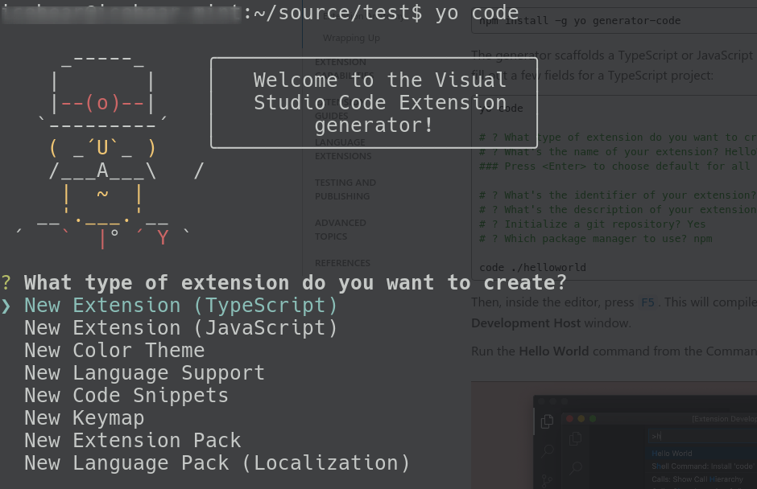
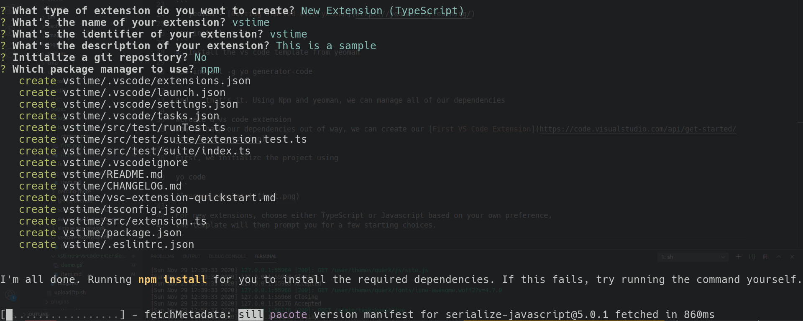
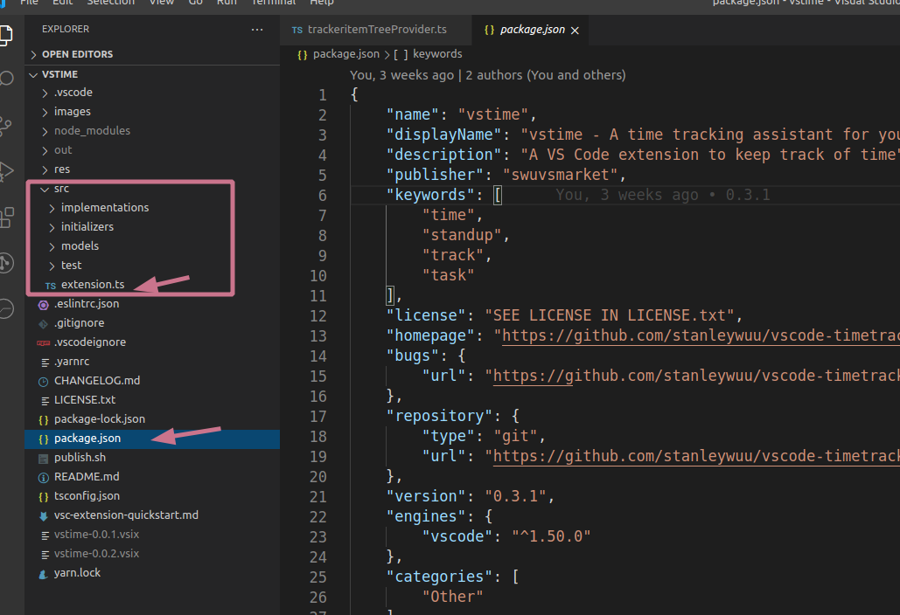
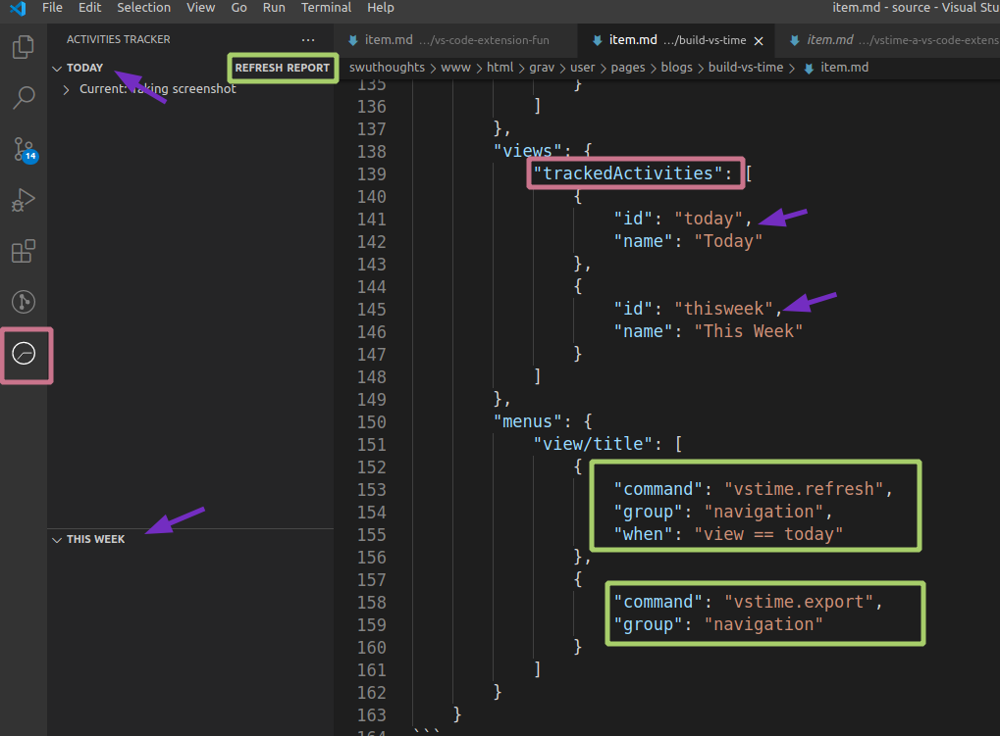

This is the first post of the series of building vs code extensions where I will go through the process of the creation of the extensions that I make for vs code.

There will be stories, there will be knowledge and there will be discussions. 
Hope you all enjoy the first post of the series.

vstime

vstime is the my first **published** extension, it is a simple extension for keeping track of what you are working on and the time breakdown of each files you interact with inside of vscode.

See [vs-time](../vstime-a-vs-code-extension-to-keep-track){:target="_blank"} to see a short description.
Here is a quick demo of what it does


##Pre-Requisite
To create a vscode-extension, we obviously need
1. vscode - If you don't have vscode, then why are you creating an extension?
2. npm - [Get npm here](https://www.npmjs.com/get-npm){:target="_blank"}
```
sudo install npm
```
3. yeoman - [Getting started with yeoman](https://yeoman.io/learning/){:target="_blank"}
```
npm install -g yo
```
4. Install the vs code template from yeoman
```
npm install -g yo generator-code
```

and... that's it. Using Npm and yeoman, we can manage all of our dependencies

##Create a vs code extension
###Initialize the project
Now we have our dependencies out of way, we can create our [First VS Code Extension](https://code.visualstudio.com/api/get-started/your-first-extension){:target="_blank"}

First, we initialize the project using
```
yo code
```


For new extensions, choose either TypeScript or Javascript based on your own preference, 
the template will then prompt you for a few starting choices.


##Now we are ready to write some code
Open the directory with vs code, we are going to develop vs code extension using vscode
```code .```

You will see that a lot was already generated for us

The three items of note
1. package.json - this is the file the manages not only the dependencies used by the project, it also serves as the configuration entry point for the extension itself.
It is referred to as the [Extension Manifest](https://code.visualstudio.com/api/get-started/extension-anatomy#extension-manifest){:target="_blank"}
2. the src folder - As the text suggests, this is where the code resides, it is where we will spend most of our time.
3. extension.ts - Inside the src folder, the ```extension.ts``` is the entry point, the default startup file. It is the equivalent of your ```void main()``` entry to a vs code extension.

###Planning the folder structure
I say this is my *first* *published* extensions, with a couple of bad starts, I believe I have developed a decent folder structure.
```
src
-- extension.ts
-- implementations
   -- implementation.ts (I will rename to trackerImplementation)
   -- reporting.ts
   -- trackeritemTreeProvider.ts
-- initializers
   -- initializer.ts
-- models
   -- trackerValues.ts
package.json
```

The idea is to keep as little as possible in ```extension.ts```. All it *should* do is to initialize the extension
The entirety of the file consists of two functions, ```activate``` and ```deactivate```
```js
// this method is called when your extension is activated
// your extension is activated the very first time the command is executed
export function activate(context: vscode.ExtensionContext) {

	// Use the console to output diagnostic information (console.log) and errors (console.error)
	// This line of code will only be executed once when your extension is activated
	console.log('Congratulations, your extension "vstime" is now active!');
	tracker = initilizers.initialize(context);
}

// this method is called when your extension is deactivated
export function deactivate() {
	if (tracker){
		tracker.stopTracker().then(()=>{});
	}
}

```
###Configuration
package.json is where all the configuration for the extension live. In our case, we have to define the following
- How to activate the extension
- The commands our extension uses (start tracking, end tracking, pause, resume etc)
- The UI elements that our extension contributes to

###package.json configuration
The package.json file determines *how* the extension is activated. In other words, it defines when ```activate``` function will get called. In our case, we acivate our extension on the ```onStartupFinished``` event. 

```json
	"activationEvents": [
		"onStartupFinished"
	]
```
According to [Microsoft Documentation](https://code.visualstudio.com/api/references/activation-events){target="_blank"}, this event is emitted and interested extensions will be activated some time after VS Code starts up. This is similar to the * activation event, but it will not slow down VS Code startup.

With the activation event set up, there are three major components we contribute to:
* commands
* viewsContainers
* views
* menus on views
 
```json
	"contributes": {
		"commands": [
			{
				"command": "vstime.test",
				"title": "test"
			},
		...	
		],
		"viewsContainers": {
			"activitybar": [
				{
					"id": "trackedActivities",
					"title": "Activities Tracker",
					"icon": "res/icon.svg"
				}
			]
		},
		"views": {
			"trackedActivities": [
				{
					"id": "today",
					"name": "Today"
				},
				{
					"id": "thisweek",
					"name": "This Week"
				}
			]
		},
		"menus": {
			"view/title": [
				{
					"command": "vstime.refresh",
					"group": "navigation",
					"when": "view == today"
				},
				{
					"command": "vstime.export",
					"group": "navigation"
				}
			]
		}
	}
```
In our definition, we added an Activites trackers panel on the left side.
It contains two views, "today" and "thisweek"


We have defined Refresh and Export as part of the menus, and refresh is only available on the today view.
Today I have a bug where the report button is visible on other containers on the left side, that's because I did not specify the when for ```vstime.export```
  
```json
    "commands": [
        {
            "command": "vstime.test",
            "title": "test"
        },
        {
            "command": "vstime.start",
            "title": "vstime: Start Tracking"
        },
        {
            "command": "vstime.stop",
            "title": "vstime: End Tracking"
        },
        {
            "command": "vstime.resume",
            "title": "vstime: Resume Tracking"
        },
        {
            "command": "vstime.pause",
            "title": "vstime: Pause Tracking"
        },
        {
            "command": "vstime.refresh",
            "title": "Refresh"
        },
        {
            "command": "vstime.export",
            "title": "Report"
        }
    ]

```

###Initializer
We can't talk about what we are initializing without discussing what we are building. Similar to the ```extension.ts```, there is only one exported function ```initialize```
```js
export function initialize(context: vscode.ExtensionContext) : impl.Tracker{
    
    // register where we can keep our data
    impl.setStoragePath(context.globalStorageUri.fsPath);

    const tracker = initializeTracker(context);

    initializeTree(context, tracker);
    initializeReportCommands(context);

    return tracker;
}
```

Really, there are only three things
* Tracker
* Tree view to display current tasks
* A command generates a report of the timing records

The tracker is the meat of this extension. ```initializeTracker``` builds a status bar item, registers the commands that are used for the extension, which include start, stop, resume and pause.

```js
function initializeTracker(context: vscode.ExtensionContext) : impl.Tracker{
    const statusBar = initializeStatusBar(context);
    const tracker = new impl.Tracker(statusBar);

    let trackStart = vscode.commands.registerCommand('vstime.start', ((p)=> {tracker.startTracker();}));
    let trackStop = vscode.commands.registerCommand('vstime.stop', (async ()=> {
        const results = await tracker.stopTracker();
        await impl.save(results);
        tracker.reset();
    }));

    let trackResume = vscode.commands.registerCommand('vstime.resume', (()=> {tracker.resumeTracker();}));
    let trackPause = vscode.commands.registerCommand('vstime.pause', (()=> {tracker.pauseTracker();}));
    
    context.subscriptions.push(trackStart);
    context.subscriptions.push(trackStop);
    context.subscriptions.push(trackResume);
    context.subscriptions.push(trackPause);

    // Set up when user switches tabs on vscode
    context.subscriptions.push(vscode.window.onDidChangeActiveTextEditor((editor) => { 
        if (editor && editor === vscode.window.activeTextEditor){
        tracker.trackChanges(editor?.document.uri.path ?? 'Untitled');}
    }));

    return tracker;
}

function initializeStatusBar(context: vscode.ExtensionContext): vscode.StatusBarItem{
    const statusBarItem = vscode.window.createStatusBarItem(vscode.StatusBarAlignment.Left, 3);
    statusBarItem.text = 'Timer Off';
    statusBarItem.command = 'vstime.start';
    statusBarItem.color = '#BEDEAD';
    context.subscriptions.push(statusBarItem);
    statusBarItem.show();

    return statusBarItem;
}
```
As you can see, all of this code is initialization. When the status bar item is created, it's passed on to the Tracker implementation.

We will go to the implementation in the next post of the series.

[Part 1 - Building the tracker](../build-vs-time-part2)