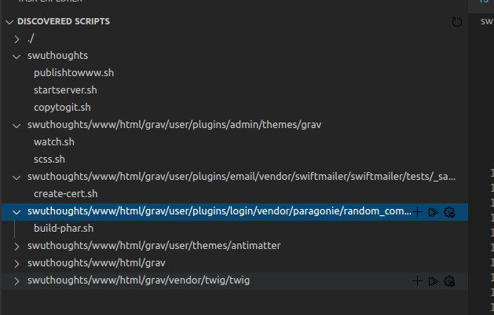

I am making a VS Code extension
Why?
* Because it's fun
* It's a good way to familiarize myself with javascript libraries
* I have scripts to upload blog to FTP
* I have scripts that starts a local Grav server for me to write posts in
* They live under different directory
* I do not want to change directory on my terminal all the time

So what's the solution?
* I decided to create a vs code extension that would
1. Scan my workspace
2. Find all of my script files (.sh, .bat, .ps. py)
3. Collect them on a pane so I can execute them
4. Execute them from where they reside (ie. if startserver.sh would execute under swuthoughts, making sure that it can locate the grav files)

But oh damn, there are too many files
This extension has taken me more time than I would have liked because now I am adding things like:
* The ability to exclude the files
* Ability to create custom tasks

[github repo](https://github.com/stanleywuu/vscode-scriptrunner)