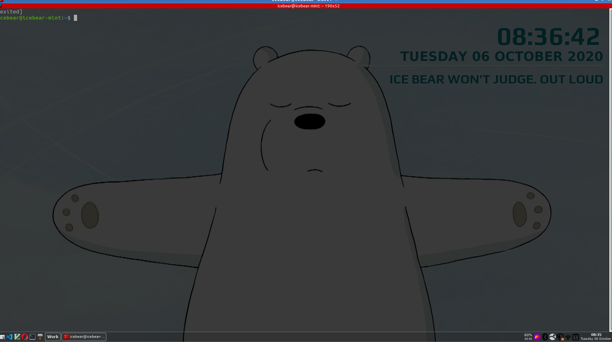

Jeez, who knew customizing something is so much work?
Who knew that I even have to manage the display settings myself?
So far the desktop is starting to take shape

1. On login, my startup script does the following
- Change the brightness setting of the screen using
```brightnessctl s 30%```
- Use xrandr to fix the positioning of my dual second monitor
```
xrandr --output HDMI-1 --left-of eDP -1
```
eDP -1 being my laptop screen
- Start Conky (of course, without conky, I could be doing this whole thing on my Windows environment, the possibilities here are endless)
- Start xcompmgr for transparency support
- Start flameshot for taking screenshots
- Using feh to set up my desktop
- Start tint2 panel

Then it sets up the work environment
- Start qutebrowser
- Start terminator**
- Start vscode ```code &```

** Still in the hunt for a nice terminal setup, terminator is nice but it has a weird habit of writing random console output from other programs when I have vim open

Terminator comes with transparency setting, it's been the one thing that keeps it in the line up right now, learning and setting up devilspie is not for a weakling like me (at this time)

2. Set up vimrc
- I am still learning more about vim, but it's about time to learn about tab and split window navigation
- Installed NerdTree
- Set up shortcuts for tab and split window

3. Solicited some advice from my friends and installed fzf
4. Created some aliases in .bashrc
- g.source -> cd to where all my git repo lives
- g.setup -> cd to my setup scripts
- g.config -> cd to my config directories

5. Installed alacritty at my friend's suggestion
- Warning, the version on Snap does not work
- TODO: Find out how I installed alacritty and include 

6. Installed TMux
- Learning tmux from zero prior knowledge is painful but it'll be worth it

Current state of my desktop
