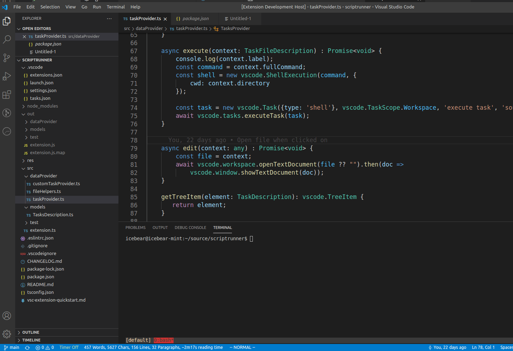

I published my extension! [vstime](https://marketplace.visualstudio.com/items?itemName=swuvsmarket.vstime)

There has been an increasing focus on the daily standups at work, I on the other hand am the type of person that works on a variety of items every day.
Be it CI/CD, backend, front end, utility tools... etc.

It's suffice to say that I do a whole lot, but I don't remember a whole lot.
Paired with my desire to work exclusively in VS code, I decided to make a small extension for just that.

##Here's are the two basic requirements
* Record when I start work
* Record when I stop work

##But why stop there?
Some additional, but equally important function are
* Provide a comment on the work
* Provide a comment when the work has been completed
* Pausing the timer
* Resuming the timer

I decided against commenting on pausing (bio break etc) because the extension is supposed to be a convenience, not a bother.

##What's the point?
If none of this data is visible? Additional functionalities were added
* Ability to display current timer on the status bar
* Show current task on the side panel
* Display detailed breakdown of time spent on each of the documents in VSCode
* Produces a text-only report of the tasks the result

##How was it?
I have to say I was pleasantly surprised, using the extension allowed me to really think what I was doing and kept me focused.
When I forgot what I was working on, I could look at the note in VS code and pick it back up.

It also was a stark reminder that I've been wasting a lot of time context switching between different types of tasks and not focusing on any of them.

So overall, I think the extension was a success, and I had a good time making the extension.

##Demo
Here is a gif to demonstrate vstime in action
1. I start tracking using the start tracking command
2. Enter a short description of what I am working on
3. Using the Panel on the left, I am able to see what I am currently working on and what I have previously worked on
4. Use end tracking to commit the record

Feel free to check it out and let me know what you think.
* Download [VS Code](https://marketplace.visualstudio.com/items?itemName=swuvsmarket.vstime)
* Source code [github](https://github.com/stanleywuu/vscode-timetracker)
